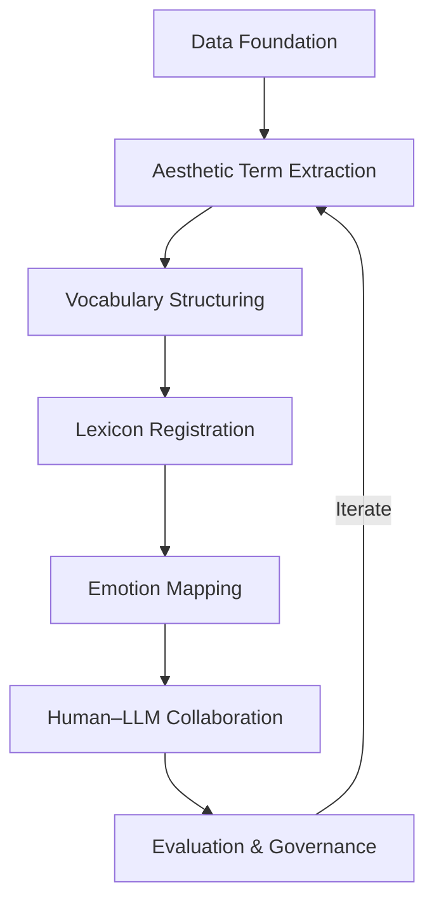

# Fashion Emotion Lexicon (FEL)
## Semantic, Aesthetic, and Emotional Structuring for Interpretable Fashion AI  

**Version:** v1.0
**Last Updated:** October 2025  
**License:** MIT  

---

## Abstract

The **Fashion Emotion Lexicon (FEL)** is a research framework designed to connect the **visual**, **aesthetic**, and **emotional** dimensions of fashion within an **ontology-based, empirically grounded system**.  

In an era where visual intelligence often prioritizes recognition over interpretation, FEL reintroduces meaning into machine perception.  
It treats fashion not merely as data but as a **cultural expression of emotion**, bridging the gap between computational precision and human sensibility.  

While traditional datasets focus mainly on garment recognition or classification [1][3],  
FEL explores **why** fashion designs evoke **specific emotions**.  
By integrating **structured lexical design**, **quantitative aesthetic principles**, and **human validation**, FEL provides an **interpretable and culturally adaptive foundation** for emotion-aware retrieval, recommendation, and creative reasoning in fashion AI.

---

## 1. Why It Matters  

Fashion is an **affective language** as much as a visual one.  
Descriptors such as *elegant*, *romantic*, or *minimal* communicate **values and emotions**, not just form.  

> *“Ruffled”* may describe a garment’s texture, but also conveys **playfulness or romantic exuberance**.  

Emotional understanding in fashion defines identity, belonging, and aspiration.  
The language of fashion mirrors cultural ideals of beauty, confidence, and resistance.  
By capturing these affective codes, FEL enables AI systems to engage with the **social meaning of style**, not only its surface appearance.  

---

## 2. Motivation and Research Gap  

Current fashion AI systems, though visually powerful, remain limited in **aesthetic and emotional reasoning**.  
They can recognize a *striped shirt* or *satin dress*, but cannot explain **why** a design feels *elegant*, *daring*, or *comforting*.  

The future of fashion AI is not only accuracy but **empathy**, systems that interpret design as a **dialogue between form and feeling**.  
FEL positions interpretability as an ethical principle, ensuring that fashion intelligence remains **human-centered, explainable, and inclusive**.  

It draws from:  
- **Quantitative Aesthetics** [4]  
- **Aesthetic Emotion Theory** [5][6][7]  
- **Empirical Fashion Emotion Studies** [9]  

Through these integrations, FEL reframes fashion data as a **living emotional language** that machines can interpret with nuance and cultural awareness.  

---

## 3. Objectives  

FEL aims to create a **fashion-specific semantic and affective lexicon** that bridges linguistic, aesthetic, and visual understanding.  

**Detailed Goals:**  
1. **Structured Lexicon:** Link garment attributes (fabric, color, silhouette) with aesthetic and emotional descriptors.  
2. **Quantitative Aesthetic Principles:** Model harmony, proportion, and simplicity through computational aesthetics.  
3. **Affective Mapping:** Represent emotional nuances using **VAD (Valence–Arousal–Dominance)** and the **Hourglass Model** to distinguish subtle affective states.  
4. **Multimodal Integration:** Combine visual embeddings and lexical meaning for emotion-aware retrieval.  
5. **Human-Centered Validation:** Ensure interpretability and cross-cultural robustness through iterative expert review.  

Traditional sentiment frameworks often collapse aesthetic language into a single “positive” pole.  
By adopting both **VAD** and **Hourglass** models, FEL preserves the *nuanced spectrum* of aesthetic affect, distinguishing between calm elegance, energetic playfulness, and introspective minimalism instead of flattening them into uniform positivity.

---

## 4. Conceptual Framework  

FEL adopts a **three-layer structure** mirroring human aesthetic perception: factual, aesthetic, and emotional.  

| Layer | Description | Key References |
|-------|-------------|----------------|
| **1. Core Layer — Factual Attributes** | Based on DeepFashion and Fashionpedia, defines garments by objective features such as silhouette, material, color, and structure. | [1][3] |
| **2. Aesthetic Layer — Design Principles & Style Language** | Encodes design qualities such as simplicity, balance, and proportion, informed by computational aesthetics and aesthetic-language theory. | [4][10] |
| **3. Affective Layer — Emotion Mapping** | Maps aesthetic descriptors to VAD and Hourglass coordinates, validated with AESTHEMOS and expert cross-cultural review. | [8][5] |

These layers explain **why** a garment feels *elegant*, *bold*, or *serene*, transforming aesthetic intuition into interpretable structure.

---

## 5. Methodological Approach  

FEL evolves through an iterative process combining computational modeling, linguistic reasoning, and human perception.

### Key Steps
- **Data foundation:** unify schemas from DeepFashion and Fashionpedia.  
- **Aesthetic extraction:** identify descriptors from curated corpora, reviews, and fashion discourse.  
- **Vocabulary structuring:** cluster and relate terms via multimodal embeddings.  
- **Lexicon registration:** document meanings, counterexamples, and provenance.  
- **Emotion mapping:** align to VAD/Hourglass, refine through collaborative human evaluation and, where feasible, physiological anchors (e.g., EEG).  
- **LLM collaboration:** generate structured definitions with expert oversight.  
- **Evaluation & governance:** emphasize interpretability and qualitative improvement, ensuring transparency and cultural fairness.  

---

## 6. Cultural and Branding Contexts  

Fashion emotions differ across culture and narrative.  
FEL embeds *regional sensitivity fields* showing how similar words carry distinct nuances, for example *elegant* may mean *refinement* in Europe but *subtle sophistication* in East Asia.  

It also defines **branding modes** (sensory, story, cause, empowerment) to capture how brand identity shapes affective resonance.  
Crowdsourced validation and expert review ensure inclusivity across diverse perspectives.

---

## 7. Ethical and Methodological Integrity  

| Principle | Implementation |
|------------|----------------|
| **Fair representation** | Diverse sources and cultural audits. |
| **Transparency** | Provenance tracking and open-source versioning. |
| **Accountability** | [Datasheets for Datasets][13] and [Model Cards][14]. |
| **Bias mitigation** | Audited generative augmentation and disparity checks. |

Generative enrichment via **Latent Diffusion Models** [12] expands aesthetic diversity while maintaining ethical safeguards.  
Each addition undergoes documentation, fairness review, and version logging.

---

## 8. Broader Impact and Vision  

| Contribution | Description |
|--------------|-------------|
| **Scientific** | Establishes the first fashion-specific affective lexicon integrating design principles and emotion models. |
| **Practical** | Enables interpretable, emotion-sensitive retrieval, recommendation, and design systems. |
| **Cultural** | Embeds emotional diversity and metadata for globally inclusive fashion understanding. |

Beyond its scientific and industrial contributions, FEL redefines how technology perceives **creativity itself**.  
It envisions a future where algorithms do not replace taste or judgment but learn to *understand* them, extending aesthetic literacy to machines and deepening the dialogue between human intuition and artificial reasoning.

---

## 9. Open Questions and Research Challenges  

| Step | Core Open Questions / Challenges | Research Implication |
|------|----------------------------------|-----------------------|
| **D0 — Goal & Scope Definition** | How should performance improvement be defined for affective fashion retrieval — text→image, image→text, or emotion→image? How can we construct a gold standard for complex queries such as “elegant satin slip dress” to measure mAP objectively? | Clear evaluation units are required; otherwise, subsequent experiments cannot be meaningfully compared. |
| **D1 — Data Preparation (DeepFashion / Fashionpedia)** | How can we automatically align inconsistent schemas (e.g., neckline vs. collar type; hemline vs. silhouette)? How should missing, duplicated, or mismatched attribute–image pairs be reconciled? | Schema noise in DF and FP directly affects all higher-level emotional inference. |
| **D2 — Seed Term Extraction (Core → Aesthetic)** | Which approach is more reliable for deriving aesthetic terms — frequency based or semantic similarity based (PMI, CLIP embedding)? How can we detect and separate context drift (e.g., satin = sensual in nightwear vs. elegant in bridalwear)? | Context-dependent polysemy must be controlled to maintain lexicon coherence. |
| **D3 — Fashion-Specific Vocabulary Integration** | What quantitative or linguistic filters can neutralize figurative or exaggerated language in non-academic sources (lookbooks, blogs)? Can we automatically separate core aesthetic terms from ephemeral trend terms (e.g., “-core” slang) using PMI, time decay, or embedding drift? | Distinguishing durable design language from transient trend slang increases lexicon stability. |
| **D4 — Lexicon Schema Registration** | When a term (e.g., sleek) co-occurs with multiple attribute sets, how do we select the representative combination? Can automatic consistency checks detect definition ↔ example ↔ counterexample contradictions? | Multi-attribute mapping ambiguity must be minimized to preserve interpretability. |
| **D5 — Ontology Graph (Core ↔ Aesthetic ↔ Emotion)** | How should the edge weight for “evokes_emotion” be computed — frequency, expert score, or semantic similarity? How can cross-lingual synonyms be merged without losing cultural nuance? | Edge weighting determines the behavior of emotion propagation across the graph. |
| **D6 — Aesthetic Scaling (Rules & Scores)** | How can we reconcile objective metrics (symmetry, color entropy) with subjective expert ratings? How can we normalize across lighting, pose, and background differences to ensure fair comparison? | Aesthetic scores are highly sensitive to visual noise; normalization is essential. |
| **D7 — Emotional Coordinates (VAD + Hourglass + TAV)** | How can we learn a shared latent space transform fθ(V,A,D → Hourglass) bridging continuous VAD and discrete Hourglass axes? When affective ratings vary cross-culturally, should we model them as multi-modal means or distributions? | Distributional emotion modeling improves cross-cultural robustness but complicates interpretability. |
| **D8 — LLM-Assisted Generation & Validation (HITL)** | How can we automatically detect hallucinated or unsupported definitions generated by LLMs? What metric best quantifies semantic alignment between LLM-generated and human-authored definitions? | Reliable automatic auditing is crucial for scalable human-in-the-loop validation. |
| **D9 — Human Labeling (HITL)** | What is the optimal session length or interface to minimize fatigue and maintain rating consistency? How should we hierarchically merge ratings from experts vs. non-experts without diluting validity? | Enhancing inter-rater reliability (α, κ) depends on cognitive ergonomics and rater stratification. |
| **D10 — Retrieval Demo (CLIP + Re-ranking)** | How can we determine the optimal re-ranking weight λ between visual similarity and aesthetic-emotion priors? When aesthetic and emotional signals conflict, how can their trade-off resolution be modeled mathematically? | Proper weighting ensures consistent improvements in emotion-aware retrieval. |
| **D11 — Generative Augmentation (Long-Tail Coverage)** | How can we guarantee that synthetic images preserve the affective distribution (VAD / Hourglass) of real data? How can we automatically detect and suppress cultural stereotypes (e.g., “sexy,” “exotic”) in prompt generation? | Affective bias in generative data directly impacts fairness and validity of emotional models. |
| **D12 — Governance & Version Management** | How can we maintain backward compatibility of emotion scales across lexicon versions? Can we automate ethics and fairness auditing logs for each public release? | Sustainable dataset governance and transparent documentation ensure long-term credibility. |

---

## 10. Core References

[1] Liu Z. et al. (2016). *DeepFashion.* CVPR. DOI: [10.1109/CVPR.2016.124](https://doi.org/10.1109/CVPR.2016.124)  
[2] Ge Y. et al. (2019). *DeepFashion2.* CVPR. DOI: [10.1109/CVPR.2019.00548](https://doi.org/10.1109/CVPR.2019.00548)  
[3] Sun P. et al. (2020). *Fashionpedia.* ECCV. DOI: [10.1007/978-3-030-58452-8_19](https://doi.org/10.1007/978-3-030-58452-8_19)  
[4] Hu H. et al. (2022). *Quantitative Aesthetic Measurement.* AEI. DOI: [10.1016/j.aei.2022.101644](https://doi.org/10.1016/j.aei.2022.101644)  
[5] Schindler I. et al. (2017). *AESTHEMOS.* PLOS ONE. DOI: [10.1371/journal.pone.0178899](https://doi.org/10.1371/journal.pone.0178899)  
[6] Schubert E. (2024). *Aesthetic Emotion Lexicon.* Empirical Studies of the Arts. DOI: [10.1177/02762374221143728](https://doi.org/10.1177/02762374221143728)  
[7] Hosoya K. et al. (2021). *Dimensions of Aesthetic Emotions.* Frontiers in Psychology. DOI: [10.3389/fpsyg.2021.667173](https://doi.org/10.3389/fpsyg.2021.667173)  
[8] Cambria A. et al. (2020). *The Hourglass Model Revisited.* IEEE Intelligent Systems. DOI: [10.1109/MIS.2020.2992799](https://doi.org/10.1109/MIS.2020.2992799)  
[9] Kim J. & Sullivan P. (2019). *Emotional Branding in Fashion.* Fashion and Textiles. DOI: [10.1186/s40691-018-0164-y](https://doi.org/10.1186/s40691-018-0164-y)  
[10] Bernardoni J. M. & Ruppert-Stroescu M. (2025). *Aesthetic Language for Fashion Design.* ITAA. DOI: [10.31274/itaa.18790](https://doi.org/10.31274/itaa.18790)  
[11] van der Laan E. & Kuipers G. (2016). *Aesthetic Boundaries in Fashion Photo Shoots.* Int. J. Fashion Studies. DOI: [10.1386/infs.3.1.47_1](https://doi.org/10.1386/infs.3.1.47_1)  
[12] Rombach R. et al. (2022). *Latent Diffusion Models.* CVPR. DOI: [10.1109/CVPR52688.2022.01042](https://doi.org/10.1109/CVPR52688.2022.01042)  
[13] Gebru T. et al. (2021). *Datasheets for Datasets.* CACM. DOI: [10.1145/3458723](https://doi.org/10.1145/3458723)  
[14] Mitchell M. et al. (2019). *Model Cards for Model Reporting.* FAccT. DOI: [10.1145/3287560.3287596](https://doi.org/10.1145/3287560.3287596)  
[15] Mohammad S. M. & Turney P. D. (2013). *NRC Emotion Lexicon.* Computational Intelligence. DOI: [10.1111/j.1467-8640.2012.00460.x](https://doi.org/10.1111/j.1467-8640.2012.00460.x)  
[16] Matteucci G. (2019). *Fashion.* International Lexicon of Aesthetics. DOI: [10.7413/18258630066](https://doi.org/10.7413/18258630066)  

---

## Project Lead  

**Younghoe Kim, Ph.D. Candidate**  
*Department of Data Science and Computation, University of Bologna*  

---

> **FEL moves beyond recognition to understanding, enabling AI to reason about elegance, empathy, and style with scientific precision and cultural depth.**
